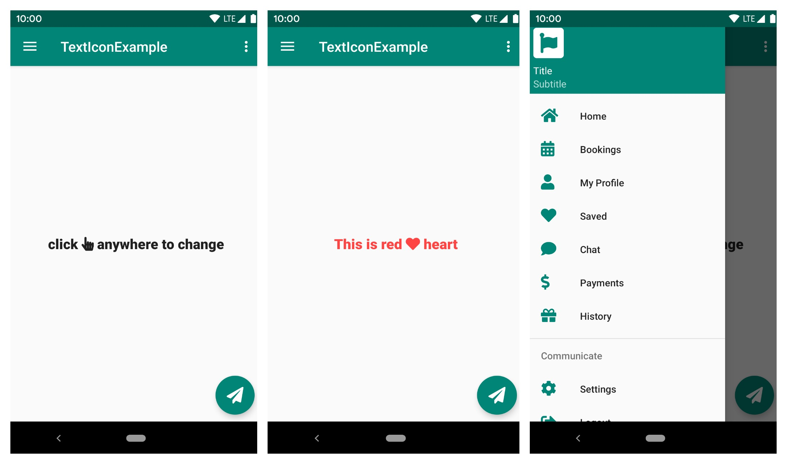

# TextIcon
<b>fa</b> is very popular icon toolkit used across many websites. It has both <b>free</b> and <b>pro</b> collection of icons, but you can find most the icons in free collection itself. Each icon will represented by <b>unicode</b>. We use this unicode to display the icon in TextView. As it’s a normal TextView, all the text styling attributes (color, size, paddings etc.,) can be applied.

For an example if you want to display <b>android Robot</b> logo, you can use <b>\&#xf17b;</b> unicode as TextView value.

In order to use the fa icon collection, you have to add the fa font files to your <strong>assets</strong> directly and apply the appropriate <strong>fontFace</strong> on to <strong>TextView</strong> which is simpler task. But we want the icons to be displayed in other widgets also like in <strong>Buttons</strong>, <strong>Menus</strong>, <strong>Bottom Navigation</strong> and <strong>Navigation Drawer</strong> etc,. Displaying icon in non-textual views takes some effort. So I have written a <a rel="nofollow" href="https://github.com/NAndroidEx/TextIcon" target="_blank" class="follow">library</a> by incorporating all the necessary methods to render the icons in multiple widgets.



# How to get?
<h3>Step 1.</h3> Add the JitPack repository to your build file
Add it in your root build.gradle at the end of repositories:

```
allprojects {
	repositories {
		...
		maven { url 'https://jitpack.io' }
	}
}
```

<h3>Step 2.</h3> Add the dependency

```
dependencies {
        implementation 'com.github.NAndroidEx:TextIcon:0.1.1'
}
```

# How to use it?
<h3>Displaying Icon in TextView</h3>

```
<com.nandroidex.texticon.FontTextView
    android:id="@+id/ftvSample"
    android:layout_width="match_parent"
    android:layout_height="match_parent"
    android:gravity="center"
    android:text="@string/fa_hand_pointer"
    android:textSize="20sp"
    app:solid_icon="true" />
```

<ul>
<li><em>solid_icon</em>: To display solid icon, set this value as <em>true</em>.</li>
<li><em>brand_icon</em>: To display brand icon, set this value as <em>true</em>.</li>
</ul>

<h3>Using FontDrawable</h3>

Using the icon in xml layout is easy, but if you want to use the icon for other widget like button or menu, you can use the <em>FontDrawable</em> element to apply the icon.

For an example, if you want to use the fa icon to Floating Action Button, you can use the FontDrawable as shown below.
```
FloatingActionButton fab = findViewById(R.id.fab);
 
// using paper plane icon for FAB
FontDrawable drawable = new FontDrawable(this, R.string.fa_paper_plane_solid, true, false);
 
// white color to icon
drawable.setTextColor(ContextCompat.getColor(this, android.R.color.white));
fab.setImageDrawable(drawable);
```

<h3>Using in Menus (Bottom Navigation, Navigation Drawer etc.,)</h3>

You can also use the font icons in the widgets that uses <strong>menu</strong> file to render the items like <strong>Toolbar icons</strong>, <strong>Bottom Navigation</strong>, <strong>Navigation Drawer</strong> etc., To render the icon in menus, you can use the FontDrawable to set the icons, but it needs few hacks through java code.

The below example shows rending the fa icons in Navigation Drawer menu.

```
public class MainActivity extends AppCompatActivity
        implements NavigationView.OnNavigationItemSelectedListener {
    @Override
    protected void onCreate(Bundle savedInstanceState) {
        super.onCreate(savedInstanceState);
        setContentView(R.layout.activity_main);
 
        intDrawerLayout();
    }
 
    /**
     * Changing navigation drawer icons
     * This involves looping through menu items and applying icons
     */
    private void intDrawerLayout() {
        NavigationView navigationView = findViewById(R.id.nav_view);
        navigationView.setNavigationItemSelectedListener(this);
 
        ImageView iconHeader = navigationView.getHeaderView(0).findViewById(R.id.nav_header_icon);
        FontDrawable drawable = new FontDrawable(this, R.string.fa_hand_pointer, false, true);
        drawable.setTextColor(ContextCompat.getColor(this, android.R.color.white));
        drawable.setTextSize(50);
        iconHeader.setImageDrawable(drawable);
 
        int[] icons = {
                R.string.fa_home_solid, R.string.fa_calendar_alt_solid, R.string.fa_user_solid,
                R.string.fa_heart_solid, R.string.fa_comment_solid, R.string.fa_dollar_sign_solid, R.string.fa_gift_solid
        };
        renderMenuIcons(navigationView.getMenu(), icons, true, false);
 
        int[] iconsSubmenu = {R.string.fa_cog_solid, R.string.fa_sign_out_alt_solid};
 
        renderMenuIcons(navigationView.getMenu().getItem(7).getSubMenu(), iconsSubmenu, true, false);
    }
 
    /**
     * Looping through menu icons are applying font drawable
     */
    private void renderMenuIcons(Menu menu, int[] icons, boolean isSolid, boolean isBrand) {
        for (int i = 0; i < menu.size(); i++) {
            MenuItem menuItem = menu.getItem(i);
            if (!menuItem.hasSubMenu()) {
                FontDrawable drawable = new FontDrawable(this, icons[i], isSolid, isBrand);
                drawable.setTextColor(ContextCompat.getColor(this, R.color.icon_nav_drawer));
                drawable.setTextSize(22);
                menu.getItem(i).setIcon(drawable);
            }
        }
    }
}
```

# Note

This library includes the <b>Free</b> fa icons only, <a href="https://fontawesome.com/pro" target="_blank">Premium</a> icons are not available.
<h3>Your contributions are welcome.</h3>

# Under Development

- change color of only icon(not whole text)
